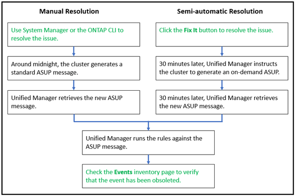

= Beheben Sie Active IQ Plattformereignisse
:allow-uri-read: 
:icons: font
:imagesdir: ../media/

[role="lead"]
Vorfälle und Risiken der Active IQ -Plattform ähneln anderen Unified Manager-Ereignissen, da sie zur Lösung anderen Benutzern zugewiesen werden können und über dieselben verfügbaren Status verfügen.  Wenn Sie diese Art von Ereignissen jedoch mit der Schaltfläche *Fix It* beheben, können Sie die Lösung innerhalb weniger Stunden überprüfen.

Das folgende Diagramm zeigt die Aktionen, die Sie ausführen müssen (in Grün) und die Aktion, die Unified Manager ausführt (in Schwarz), wenn Ereignisse aufgelöst werden, die von der Active IQ Plattform generiert wurden.

Wenn Sie eine manuelle Lösung durchführen, müssen Sie sich beim System Manager oder der ONTAP Befehlszeilenschnittstelle anmelden, um das Problem zu beheben.  Sie können das Problem erst überprüfen, nachdem der Cluster um Mitternacht eine neue AutoSupport -Nachricht generiert hat.

Wenn Sie eine halbautomatische Lösung mit der Schaltfläche *Fix It* durchführen, können Sie innerhalb weniger Stunden überprüfen, ob die Lösung erfolgreich war.
