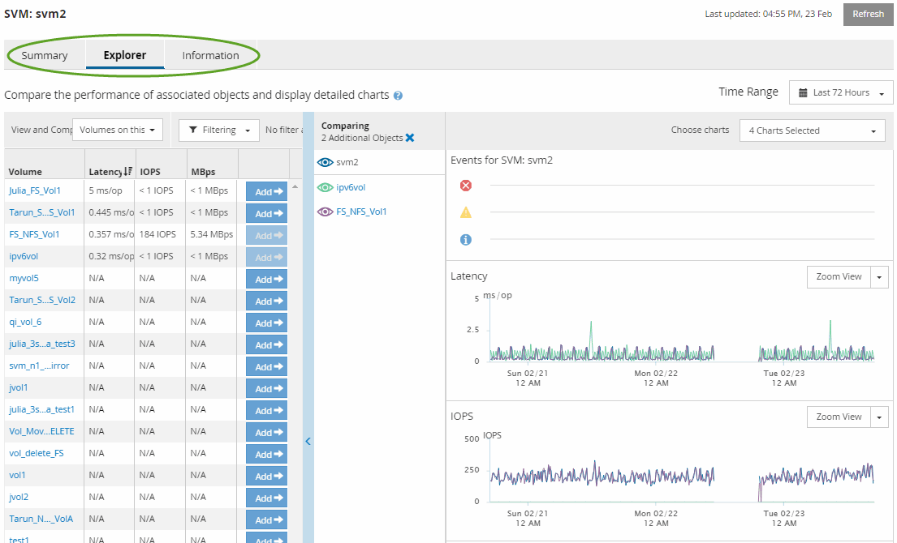

= Komponenten der Objekt-Landingpages
:allow-uri-read: 
:icons: font
:imagesdir: ../media/

[role="lead"]
Die Objekt-Landingpages bieten Details zu allen kritischen, Warn- und Informationsereignissen.  Sie bieten einen detaillierten Einblick in die Leistung aller Clusterobjekte und ermöglichen Ihnen die Auswahl und den Vergleich einzelner Objekte über verschiedene Zeiträume hinweg.

Auf den Objekt-Landingpages können Sie die Gesamtleistung aller Objekte prüfen und die Leistungsdaten der Objekte nebeneinander vergleichen.  Dies ist bei der Leistungsbewertung und der Fehlerbehebung von Ereignissen hilfreich.

[NOTE]
====
Die in den Zählerübersichtsfeldern und in den Zählerdiagrammen angezeigten Daten basieren auf einem fünfminütigen Abtastintervall.  Die im Objektinventarraster auf der linken Seite der Seite angezeigten Daten basieren auf einem einstündigen Stichprobenintervall.

====
Das folgende Bild zeigt ein Beispiel einer Objekt-Landingpage, auf der die Explorer-Informationen angezeigt werden:

Abhängig vom angezeigten Speicherobjekt kann die Objekt-Landingpage die folgenden Registerkarten enthalten, die Leistungsdaten zum Objekt bereitstellen:

* Zusammenfassung
+
Zeigt drei oder vier Zählerdiagramme mit den Ereignissen und der Leistung pro Objekt für den vorangegangenen 72-Stunden-Zeitraum an, einschließlich einer Trendlinie, die die Höchst- und Tiefstwerte während dieses Zeitraums anzeigt.

* Forscher
+
Zeigt ein Raster der Speicherobjekte an, die mit dem aktuellen Objekt in Beziehung stehen, sodass Sie die Leistungswerte des aktuellen Objekts mit denen der zugehörigen Objekte vergleichen können.  Diese Registerkarte enthält bis zu elf Zählerdiagramme und einen Zeitbereichswähler, mit denen Sie verschiedene Vergleiche durchführen können.

* Information
+
Zeigt Werte für nicht leistungsbezogene Konfigurationsattribute zum Speicherobjekt an, einschließlich der installierten Version der ONTAP -Software, des HA-Partnernamens und der Anzahl der Ports und LIFs.

* Top-Performer
+
Für Cluster: Zeigt die Speicherobjekte mit der höchsten oder niedrigsten Leistung an, basierend auf dem von Ihnen ausgewählten Leistungsindikator.

* Failover-Planung
+
Für Knoten: Zeigt die Schätzung der Leistungseinbußen für einen Knoten an, wenn der HA-Partner des Knotens ausfällt.

* Details
+
Für Volumes: Zeigt detaillierte Leistungsstatistiken für alle E/A-Aktivitäten und Vorgänge für die ausgewählte Volume-Arbeitslast an.  Diese Registerkarte ist für FlexVol -Volumes, FlexGroup -Volumes und Bestandteile von FlexGroups verfügbar.

