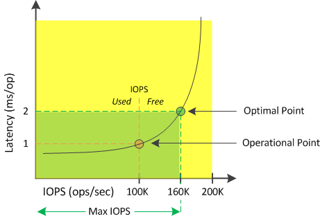

= Welche IOPS sind verfügbar?
:allow-uri-read: 
:icons: font
:imagesdir: ../media/

[role="lead"]
Der Zähler für verfügbare IOPS gibt die verbleibende Anzahl an IOPS an, die einem Knoten oder einem Aggregat hinzugefügt werden können, bevor die Ressource ihr Limit erreicht.

Die Gesamt-IOPS, die ein Knoten bereitstellen kann, basieren auf den physischen Eigenschaften des Knotens, beispielsweise der Anzahl der CPUs, der CPU-Geschwindigkeit und der RAM-Menge.  Die Gesamt-IOPS, die ein Aggregat bereitstellen kann, basieren auf den physischen Eigenschaften der Datenträger, beispielsweise einem SATA-, SAS- oder SSD-Datenträger.

Die Gesamt-IOPS aller Volumes in einem Aggregat stimmen möglicherweise nicht mit der Gesamt-IOPS des Aggregats überein.  Dies wird im folgenden Knowledge Base-Artikel erläutert: KBlink:https://kb.netapp.com/Advice_and_Troubleshooting/Data_Infrastructure_Management/Active_IQ_Unified_Manager/Why_does_the_sum_of_all_volume_IOPs_in_an_aggregate_not_match_the_aggregate_IOPs%3F["Warum stimmt die Summe aller Volume-IOPs in einem Aggregat nicht mit den aggregierten IOPs überein?"]

Während der Zähler für die freie Leistungskapazität den Prozentsatz einer Ressource angibt, der noch verfügbar ist, gibt der Zähler für verfügbare IOPS die genaue Anzahl an IOPS (Workloads) an, die einer Ressource hinzugefügt werden können, bevor die maximale Leistungskapazität erreicht wird.

Wenn Sie beispielsweise ein Paar FAS2520- und FAS8060-Speichersysteme verwenden, bedeutet ein freier Leistungskapazitätswert von 30 %, dass Sie über freie Leistungskapazität verfügen.  Dieser Wert gibt jedoch keinen Aufschluss darüber, wie viele weitere Workloads Sie auf diesen Knoten bereitstellen können.  Der Zähler für verfügbare IOPS zeigt möglicherweise an, dass auf dem FAS8060 500 IOPS verfügbar sind, auf dem FAS2520 jedoch nur 100 IOPS.

In der folgenden Abbildung wird eine Beispielkurve der Latenz im Vergleich zu IOPS für einen Knoten angezeigt.

Die maximale Anzahl an IOPS, die eine Ressource bereitstellen kann, ist die Anzahl an IOPS, wenn der Leistungskapazitätszähler bei 100 % liegt (dem optimalen Punkt).  Der Betriebspunkt gibt an, dass der Knoten derzeit mit 100.000 IOPS und einer Latenz von 1,0 ms/Operation arbeitet.  Basierend auf den vom Knoten erfassten Statistiken ermittelt Unified Manager, dass die maximalen IOPS für den Knoten 160.000 betragen, was bedeutet, dass 60.000 freie oder verfügbare IOPS vorhanden sind.  Daher können Sie diesem Knoten weitere Workloads hinzufügen, sodass Ihre Systeme effizienter genutzt werden.

[NOTE]
====
Bei minimaler Benutzeraktivität in der Ressource wird der verfügbare IOPS-Wert unter der Annahme einer allgemeinen Arbeitslast berechnet, die auf etwa 4.500 IOPS pro CPU-Kern basiert.  Dies liegt daran, dass Unified Manager nicht über die Daten verfügt, um die Eigenschaften der zu verarbeitenden Arbeitslast genau einzuschätzen.

====