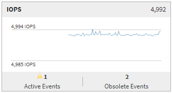

= Zusammenfassungsseite
:allow-uri-read: 
:icons: font
:imagesdir: ../media/

[role="lead"]
Auf der Seite „Zusammenfassung“ werden Zählerdiagramme angezeigt, die Details zu den Ereignissen und der Leistung pro Objekt für den vorangegangenen 72-Stunden-Zeitraum enthalten.  Diese Daten werden nicht automatisch aktualisiert, sind aber zum Zeitpunkt des letzten Seitenaufrufs aktuell.  Die Diagramme auf der Übersichtsseite beantworten die Frage: „Muss ich weiter suchen?“

== Diagramme und Zählerstatistiken

Die Übersichtsdiagramme bieten einen schnellen Überblick über die letzten 72 Stunden und helfen Ihnen, mögliche Probleme zu erkennen, die einer weiteren Untersuchung bedürfen.

Die Zählerstatistiken der Zusammenfassungsseite werden in Diagrammen angezeigt.

Sie können Ihren Cursor über der Trendlinie in einem Diagramm positionieren, um die Zählerwerte für einen bestimmten Zeitpunkt anzuzeigen.  Die Übersichtsdiagramme zeigen außerdem die Gesamtzahl der aktiven kritischen Ereignisse und Warnereignisse für den vorangegangenen 72-Stunden-Zeitraum für die folgenden Zähler an:

* *Latenz*
+
Durchschnittliche Antwortzeit für alle E/A-Anfragen; ausgedrückt in Millisekunden pro Vorgang.

+
Wird für alle Objekttypen angezeigt.

* *IOPS*
+
Durchschnittliche Betriebsgeschwindigkeit, ausgedrückt in Eingabe-/Ausgabevorgängen pro Sekunde.

+
Wird für alle Objekttypen angezeigt.

* *MB/s*
+
Durchschnittlicher Durchsatz; ausgedrückt in Megabyte pro Sekunde.

+
Wird für alle Objekttypen angezeigt.

* *Ausgenutzte Leistungskapazität*
+
Prozentsatz der Leistungskapazität, die von einem Knoten oder Aggregat verbraucht wird.

+
Wird nur für Knoten und Aggregate angezeigt.

* *Verwendung*
+
Prozentsatz der Objektauslastung für Knoten und Aggregate oder Bandbreitenauslastung für Ports.

+
Wird nur für Knoten, Aggregate und Ports angezeigt.

Wenn Sie den Cursor über die Ereignisanzahl für aktive Ereignisse positionieren, werden Typ und Anzahl der Ereignisse angezeigt.  Kritische Ereignisse werden rot angezeigt (image:../media/treemapred_png.gif["Symbol für TreeMap – Farbe Rot"] ) und Warnereignisse werden gelb angezeigt (image:../media/treemapstatus_warning_png.gif["Symbol für TreeMap – Warnstatus"] ).

Die Zahl oben rechts im Diagramm im grauen Balken ist der Durchschnittswert der letzten 72 Stunden.  Die unten und oben im Trendliniendiagramm angezeigten Zahlen stellen die Mindest- und Höchstwerte für den letzten 72-Stunden-Zeitraum dar.  Der graue Balken unter dem Diagramm enthält die Anzahl der aktiven (neuen und bestätigten) Ereignisse und veralteten Ereignisse aus dem letzten 72-Stunden-Zeitraum.

* *Latenzzählerdiagramm*
+
Das Latenzzählerdiagramm bietet einen allgemeinen Überblick über die Objektlatenz für den vorangegangenen 72-Stunden-Zeitraum.  Latenz bezieht sich auf die durchschnittliche Antwortzeit für alle E/A-Anfragen; ausgedrückt in Millisekunden pro Vorgang, die Servicezeit, Wartezeit oder beides, die ein Datenpaket oder Block in der betreffenden Cluster-Speicherkomponente erfährt.

+
*Oben (Zählerwert):* Die Zahl in der Kopfzeile zeigt den Durchschnitt der letzten 72 Stunden an.

+
*Mitte (Leistungsdiagramm):* Die Zahl unten im Diagramm zeigt die niedrigste Latenz und die Zahl oben im Diagramm zeigt die höchste Latenz für den vorangegangenen 72-Stunden-Zeitraum an.  Positionieren Sie den Cursor über der Trendlinie des Diagramms, um den Latenzwert für einen bestimmten Zeitpunkt anzuzeigen.

+
*Unten (Ereignisse):* Beim Darüberfahren zeigt das Popup die Details der Ereignisse an.  Klicken Sie unter dem Diagramm auf den Link *Aktive Ereignisse*, um zur Seite „Ereignisinventar“ zu navigieren und alle Ereignisdetails anzuzeigen.

* *IOPS-Zählerdiagramm*
+
Das IOPS-Zählerdiagramm bietet einen umfassenden Überblick über den IOPS-Zustand des Objekts für den vorangegangenen 72-Stunden-Zeitraum.  IOPS gibt die Geschwindigkeit des Speichersystems in Anzahl der Eingabe-/Ausgabevorgänge pro Sekunde an.

+
*Oben (Zählerwert):* Die Zahl in der Kopfzeile zeigt den Durchschnitt der letzten 72 Stunden an.

+
*Mitte (Leistungsdiagramm):* Die Zahl unten im Diagramm zeigt die niedrigsten IOPS und die Zahl oben im Diagramm zeigt die höchsten IOPS für den vorangegangenen 72-Stunden-Zeitraum an.  Positionieren Sie den Cursor über der Trendlinie des Diagramms, um den IOPS-Wert für einen bestimmten Zeitraum anzuzeigen.

+
*Unten (Ereignisse):* Beim Darüberfahren zeigt das Popup die Details der Ereignisse an.  Klicken Sie unter dem Diagramm auf den Link *Aktive Ereignisse*, um zur Seite „Ereignisinventar“ zu navigieren und alle Ereignisdetails anzuzeigen.

* *MB/s-Zählerdiagramm*
+
Das MB/s-Zählerdiagramm zeigt die MB/s-Leistung des Objekts an und gibt an, wie viele Daten in Megabyte pro Sekunde zum und vom Objekt übertragen wurden.  Das MB/s-Zählerdiagramm bietet einen umfassenden Überblick über den MB/s-Zustand des Objekts für den vorangegangenen 72-Stunden-Zeitraum.

+
*Oben (Zählerwert):* Die Zahl in der Kopfzeile zeigt die durchschnittliche Anzahl an MB/s für den vorangegangenen 72-Stunden-Zeitraum an.

+
*Mitte (Leistungsdiagramm):* Der Wert unten im Diagramm zeigt die niedrigste Anzahl an MB/s und der Wert oben im Diagramm zeigt die höchste Anzahl an MB/s für den vorangegangenen 72-Stunden-Zeitraum.  Positionieren Sie Ihren Cursor über der Trendlinie des Diagramms, um den MB/s-Wert für einen bestimmten Zeitraum anzuzeigen.

+
*Unten (Ereignisse):* Beim Darüberfahren zeigt das Popup die Details der Ereignisse an.  Klicken Sie unter dem Diagramm auf den Link *Aktive Ereignisse*, um zur Seite „Ereignisinventar“ zu navigieren und alle Ereignisdetails anzuzeigen.

* *Leistungskapazitäts-Zählerdiagramm*
+
Das Zählerdiagramm „Verwendete Leistungskapazität“ zeigt den Prozentsatz der Leistungskapazität an, die vom Objekt verbraucht wird.

+
*Oben (Zählerwert):* Die Zahl in der Kopfzeile zeigt die durchschnittlich genutzte Leistungskapazität der letzten 72 Stunden an.

+
*Mitte (Leistungsdiagramm):* Der Wert unten im Diagramm zeigt den niedrigsten Prozentsatz der genutzten Leistungskapazität und der Wert oben im Diagramm zeigt den höchsten Prozentsatz der genutzten Leistungskapazität für den vorangegangenen 72-Stunden-Zeitraum.  Positionieren Sie den Cursor über der Trendlinie des Diagramms, um den Wert der genutzten Leistungskapazität für einen bestimmten Zeitraum anzuzeigen.

+
*Unten (Ereignisse):* Beim Darüberfahren zeigt das Popup die Details der Ereignisse an.  Klicken Sie unter dem Diagramm auf den Link *Aktive Ereignisse*, um zur Seite „Ereignisinventar“ zu navigieren und alle Ereignisdetails anzuzeigen.

* *Auslastungszählerdiagramm*
+
Das Auslastungszählerdiagramm zeigt den Prozentsatz der Objektauslastung an.  Das Auslastungszählerdiagramm bietet einen umfassenden Überblick über den Prozentsatz der Objekt- oder Bandbreitenauslastung für den vorangegangenen 72-Stunden-Zeitraum.

+
*Oben (Zählerwert):* Die Zahl in der Kopfzeile zeigt den durchschnittlichen Auslastungsprozentsatz für den vorangegangenen 72-Stunden-Zeitraum an.

+
*Mitte (Leistungsdiagramm):* Der Wert unten im Diagramm zeigt den niedrigsten Auslastungsprozentsatz und der Wert oben im Diagramm zeigt den höchsten Auslastungsprozentsatz für den vorangegangenen 72-Stunden-Zeitraum.  Positionieren Sie den Cursor über der Trendlinie des Diagramms, um den Auslastungswert für einen bestimmten Zeitraum anzuzeigen.

+
*Unten (Ereignisse):* Beim Darüberfahren zeigt das Popup die Details der Ereignisse an.  Klicken Sie unter dem Diagramm auf den Link *Aktive Ereignisse*, um zur Seite „Ereignisinventar“ zu navigieren und alle Ereignisdetails anzuzeigen.

== Veranstaltungen

In der Ereignisverlaufstabelle werden, sofern zutreffend, die aktuellsten Ereignisse aufgelistet, die bei diesem Objekt aufgetreten sind.  Wenn Sie auf den Ereignisnamen klicken, werden auf der Seite „Ereignisdetails“ Details zum Ereignis angezeigt.
