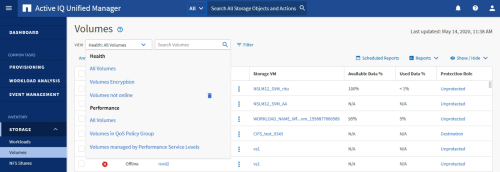

= Verstehen der Ansichts- und Berichtsbeziehung
:allow-uri-read: 
:icons: font
:imagesdir: ../media/

[role="lead"]
Ansichten und Inventarseiten werden zu Berichten, wenn Sie sie herunterladen oder planen.

Sie können Ansichten und Inventarseiten anpassen und zur Wiederverwendung speichern.  Fast alles, was Sie in Unified Manager anzeigen können, kann als Bericht gespeichert, wiederverwendet, angepasst, geplant und freigegeben werden.

In der Dropdown-Liste „Ansicht“ handelt es sich bei Elementen mit dem Löschsymbol um vorhandene benutzerdefinierte Ansichten, die Sie oder ein anderer Benutzer erstellt haben.  Elemente ohne Symbol sind Standardansichten, die mit Unified Manager bereitgestellt werden.  Standardansichten können nicht geändert oder gelöscht werden.

[NOTE]
====
* Wenn Sie eine benutzerdefinierte Ansicht aus der Liste löschen, werden auch alle Excel-Dateien oder geplanten Berichte gelöscht, die diese Ansicht verwenden.
* Wenn Sie eine benutzerdefinierte Ansicht ändern, wird die Änderung in Berichten, die diese Ansicht verwenden, beim nächsten Generieren des Berichts und Versenden per E-Mail gemäß dem Berichtszeitplan angezeigt.  Achten Sie beim Ändern der Ansichten darauf, dass Ihre Änderungen mit allen zugehörigen Excel-Anpassungen funktionieren, die für die Berichte verwendet werden.  Bei Bedarf können Sie die Excel-Datei aktualisieren, indem Sie sie herunterladen, die erforderlichen Änderungen vornehmen und sie als neue Excel-Anpassung für die Ansicht hochladen.

====

Nur Benutzer mit der Rolle „Anwendungsadministrator“ oder „Speicheradministrator“ können das Löschsymbol sehen, eine Ansicht ändern oder löschen oder einen geplanten Bericht ändern oder löschen.
