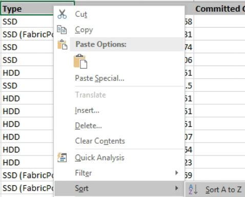

= Erstellen Sie einen Bericht, um Diagramme mit der Gesamtsumme und der verfügbaren Kapazität anzuzeigen
:allow-uri-read: 
:icons: font
:imagesdir: ../media/

[role="lead"]
Sie können einen Bericht erstellen, um die Gesamtspeicherkapazität und die zugesagte Kapazität in einem Excel-Diagrammformat zu analysieren.

.Bevor Sie beginnen
* Sie müssen über die Rolle „Anwendungsadministrator“ oder „Speicheradministrator“ verfügen.

Führen Sie die folgenden Schritte aus, um eine Ansicht „Integrität: Alle Aggregate“ zu öffnen, die Ansicht in Excel herunterzuladen, ein Diagramm mit der Gesamt- und der zugesagten Kapazität zu erstellen, die angepasste Excel-Datei hochzuladen und den Abschlussbericht zu planen.

.Schritte
. Klicken Sie im linken Navigationsbereich auf *Speicher* > *Aggregate*.
. Wählen Sie *Berichte* > *Excel herunterladen*.
+
image::../media/download_excel_menu.png[Ein UI-Screenshot, der zeigt, wie Excel aus Berichten heruntergeladen wird.]

+
Abhängig von Ihrem Browser müssen Sie möglicherweise auf *OK* klicken, um die Datei zu speichern.

. Öffnen Sie die heruntergeladene Datei in Excel.
. Klicken Sie bei Bedarf auf *Bearbeitung aktivieren*.
. Klicken Sie im Datenblatt mit der rechten Maustaste auf die Spalte Typ und wählen Sie *Sortieren* > *Sortieren von A bis Z*.
+

+
Dadurch werden Ihre Daten nach Speichertyp sortiert, beispielsweise:

+
** Festplatte
** Hybrid
** SSD
** SSD (FabricPool)

. Wählen Sie die `Type, Total Data Capacity,` Und `Available Data Capacity` Spalten.
. Wählen Sie im Menü *Einfügen* eine `3-D column` Diagramm.
+
Das Diagramm erscheint auf dem Datenblatt.

+
image::../media/3d_column_01.png[Ein UI-Screenshot, der das 3D-Säulendiagramm zeigt.]

. Klicken Sie mit der rechten Maustaste auf das Diagramm und wählen Sie *Diagramm verschieben*.
. Wählen Sie *Neues Blatt* und benennen Sie das Blatt *Total Storage Charts*.
+
[NOTE]
====
Achten Sie darauf, dass das neue Blatt nach den Info- und Datenblättern erscheint.

====
. Benennen Sie das Diagramm mit *Gesamtkapazität im Vergleich zur verfügbaren Kapazität*.
. Mithilfe der Menüs *Entwurf* und *Format*, die verfügbar sind, wenn das Diagramm ausgewählt ist, können Sie das Aussehen des Diagramms anpassen.
. Wenn Sie zufrieden sind, speichern Sie die Datei mit Ihren Änderungen.  Ändern Sie weder den Dateinamen noch den Speicherort.
+
image::../media/total_vs_available_capacity.png[Ein UI-Screenshot, der ein Diagramm der Gesamtkapazität im Vergleich zur verfügbaren Kapazität zeigt.]

. Wählen Sie im Unified Manager *Berichte* > *Excel hochladen*.
+
[NOTE]
====
Stellen Sie sicher, dass Sie sich in derselben Ansicht befinden, in der Sie die Excel-Datei heruntergeladen haben.

====
. Wählen Sie die Excel-Datei aus, die Sie geändert haben.
. Klicken Sie auf *Öffnen*.
. Klicken Sie auf *Senden*.
+
Neben dem Menüpunkt *Berichte* > *Excel hochladen* wird ein Häkchen angezeigt.

+
image::../media/upload_excel.png[Ein UI-Screenshot, der zeigt, wie Excel in Berichte hochgeladen wird.]

. Klicken Sie auf *Geplante Berichte*.
. Klicken Sie auf *Zeitplan hinzufügen*, um der Seite *Berichtszeitpläne* eine neue Zeile hinzuzufügen, damit Sie die Zeitplanmerkmale für den neuen Bericht definieren können.
+
[NOTE]
====
Wählen Sie das *XLSX*-Format für den Bericht.

====
. Geben Sie einen Namen für den Berichtszeitplan ein und füllen Sie die anderen Berichtsfelder aus. Klicken Sie dann auf das Häkchen (image:../media/blue_check.gif[""] ) am Ende der Zeile.
+
Der Bericht wird sofort testweise versendet.  Anschließend wird der Bericht generiert und in der angegebenen Häufigkeit per E-Mail an die aufgeführten Empfänger gesendet.

Basierend auf den im Bericht angezeigten Ergebnissen möchten Sie möglicherweise die Last Ihrer Aggregate ausgleichen.
