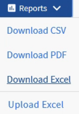
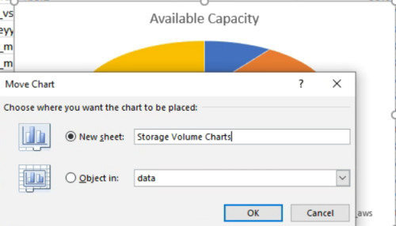

= Erstellen Sie einen Bericht, um Diagramme zur verfügbaren Datenträgerkapazität anzuzeigen
:allow-uri-read: 
:icons: font
:imagesdir: ../media/

[role="lead"]
Sie können einen Bericht erstellen, um die verfügbare Datenträgerkapazität in einem Excel-Diagramm zu analysieren.

.Bevor Sie beginnen
* Sie müssen über die Rolle „Anwendungsadministrator“ oder „Speicheradministrator“ verfügen.

Führen Sie die folgenden Schritte aus, um eine Ansicht „Integrität: Alle Volumes“ zu öffnen, die Ansicht in Excel herunterzuladen, ein Diagramm der verfügbaren Kapazität zu erstellen, die benutzerdefinierte Excel-Datei hochzuladen und den Abschlussbericht zu planen.

.Schritte
. Klicken Sie im linken Navigationsbereich auf *Speicher* > *Volumes*.
. Wählen Sie *Berichte* > *Excel herunterladen*.
+

+
Abhängig von Ihrem Browser müssen Sie möglicherweise auf *OK* klicken, um die Datei zu speichern.

. Klicken Sie bei Bedarf auf *Bearbeitung aktivieren*.
. Öffnen Sie die heruntergeladene Datei in Excel.
. Auf der `data` wählen Sie die Daten aus, die Sie im `Volume` Und `Available Data` % Spalten.
. Wählen Sie im Menü *Einfügen* eine `3-D piechart.`
+
Das Diagramm zeigt, welche Volumes über den größten verfügbaren Speicherplatz verfügen.  Das Diagramm erscheint auf dem Datenblatt.

+
[NOTE]
====
Abhängig von Ihrer Netzwerkkonfiguration kann die Auswahl ganzer Spalten oder zu vieler Datenzeilen dazu führen, dass Ihr Kreisdiagramm unleserlich wird.  In diesem Beispiel wird das 3D-Kreisdiagramm verwendet, Sie können jedoch jeden Diagrammtyp verwenden.  Verwenden Sie das Diagramm, das die Daten, die Sie erfassen möchten, am besten darstellt.

====
. Benennen Sie den Diagrammtitel mit *Verfügbare Kapazität*.
. Klicken Sie mit der rechten Maustaste auf das Diagramm und wählen Sie *Diagramm verschieben*.
. Wählen Sie *Neues Blatt* und benennen Sie das Blatt *Storage Volume Charts*.
+
[NOTE]
====
Achten Sie darauf, dass das neue Blatt nach den Info- und Datenblättern erscheint.

====
+

. Mithilfe der Menüs *Entwurf* und *Format*, die verfügbar sind, wenn das Diagramm ausgewählt ist, können Sie das Aussehen des Diagramms anpassen.
. Wenn Sie zufrieden sind, speichern Sie die Datei mit Ihren Änderungen.
. Wählen Sie im Unified Manager *Berichte* > *Excel hochladen*.
+
[NOTE]
====
Stellen Sie sicher, dass Sie sich in derselben Ansicht befinden, in der Sie die Excel-Datei heruntergeladen haben.

====
. Wählen Sie die Excel-Datei aus, die Sie geändert haben.
. Klicken Sie auf *Öffnen*.
. Klicken Sie auf *Senden*.
+
Neben dem Menüpunkt *Berichte* > *Excel hochladen* wird ein Häkchen angezeigt.

+
image::../media/upload_excel.png[Ein UI-Screenshot, der zeigt, wie Excel in Berichte hochgeladen wird.]

. Klicken Sie auf *Geplante Berichte*.
. Klicken Sie auf *Zeitplan hinzufügen*, um der Seite *Berichtszeitpläne* eine neue Zeile hinzuzufügen, damit Sie die Zeitplanmerkmale für den neuen Bericht definieren können.
. Geben Sie einen Namen für den Berichtszeitplan ein und füllen Sie die anderen Berichtsfelder aus. Klicken Sie dann auf das Häkchen (image:../media/blue_check.gif[""] ) am Ende der Zeile.
+
[NOTE]
====
Wählen Sie das *XLSX*-Format für den Bericht.

====
+
Der Bericht wird sofort testweise versendet.  Anschließend wird der Bericht generiert und in der angegebenen Häufigkeit per E-Mail an die aufgeführten Empfänger gesendet.

Basierend auf den im Bericht angezeigten Ergebnissen möchten Sie möglicherweise die Last auf Ihren Datenträgern ausgleichen.
