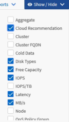

= Spalten anpassen
:allow-uri-read: 
:icons: font
:imagesdir: ../media/

[role="lead"]
Verwenden Sie *Anzeigen/Ausblenden*, um die Spalten auszuwählen, die Sie in Ihrem Bericht verwenden möchten.  Ziehen Sie die Spalten auf der Inventarseite, um sie neu anzuordnen.

.Schritte
. Klicken Sie auf *Anzeigen/Ausblenden*, um Spalten hinzuzufügen oder zu entfernen.
+

. Ziehen Sie auf der Inventarseite die Spalten, um sie in der gewünschten Reihenfolge für Ihren Bericht anzuordnen.
. Benennen Sie die nicht gespeicherte Ansicht, um Ihre Änderungen zu speichern.

