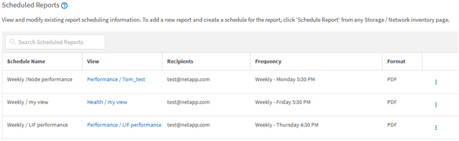

= Geplante Berichte löschen
:allow-uri-read: 
:icons: font
:imagesdir: ../media/

[role="lead"]
Nachdem Berichte geplant wurden, können Sie sie auf der Seite „Berichtszeitpläne“ löschen.

.Bevor Sie beginnen
* Sie müssen über die Rolle „Anwendungsadministrator“ oder „Speicheradministrator“ verfügen.

.Schritte
. Klicken Sie im linken Navigationsbereich auf *Speicherverwaltung* > *Berichtszeitpläne*.
+

+
[NOTE]
====
Wenn Sie über die entsprechenden Berechtigungen verfügen, können Sie jeden Bericht und seinen Zeitplan im System entfernen.

====
. Klicken Sie auf das Symbol „Mehr“image:../media/more_icon.gif[""] für den Zeitplan, den Sie entfernen möchten.
. Klicken Sie auf *Löschen*.
. Bestätigen Sie Ihre Entscheidung.
+
Der geplante Bericht wird aus der Liste entfernt und nicht mehr gemäß dem festgelegten Zeitplan erstellt und verteilt.

+
[NOTE]
====
Wenn Sie eine benutzerdefinierte Ansicht von der Inventarseite löschen, werden auch alle benutzerdefinierten Excel-Dateien oder geplanten Berichte gelöscht, die diese Ansicht verwenden.

====

