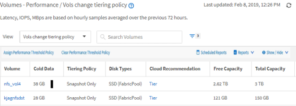
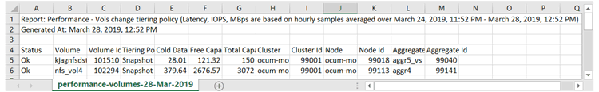
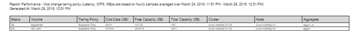

= Schnellstart zur Berichterstellung
:allow-uri-read: 
:icons: font
:imagesdir: ../media/

[role="lead"]
Erstellen Sie einen benutzerdefinierten Beispielbericht, um das Erkunden von Ansichten und Planen von Berichten zu erleben.  Dieser Schnellstartbericht enthält eine Liste von Volumes, die Sie möglicherweise in die Cloud-Ebene verschieben möchten, da dort eine beträchtliche Menge inaktiver (kalter) Daten vorhanden ist.  Sie öffnen die Ansicht „Leistung: Alle Volumes“, passen die Ansicht mithilfe von Filtern und Spalten an, speichern die benutzerdefinierte Ansicht als Bericht und planen die wöchentliche Freigabe des Berichts.

.Bevor Sie beginnen
* Sie müssen über die Rolle „Anwendungsadministrator“ oder „Speicheradministrator“ verfügen.
* Sie müssen FabricPool Aggregate konfiguriert haben und über Volumes auf diesen Aggregaten verfügen.

Führen Sie die folgenden Schritte aus, um:

* Öffnen der Standardansicht
* Passen Sie die Spalten an, indem Sie die Daten filtern und sortieren
* Speichern der Ansicht
* Planen Sie die Generierung eines Berichts für die benutzerdefinierte Ansicht

.Schritte
. Klicken Sie im linken Navigationsbereich auf *Speicher* > *Volumes*.
. Wählen Sie im Menü „Ansicht“ die Option „Leistung“ > „Alle Volumes“ aus.
. Klicken Sie auf *Anzeigen/Ausblenden*, um sicherzustellen, dass die Spalte „Datenträgertypen“ in der Ansicht angezeigt wird.
+
image::../media/show_hide_3.png[Ein UI-Screenshot, der die Dropdown-Liste des Menüs „Einblenden/Ausblenden“ zeigt.]

+
Fügen Sie weitere Spalten hinzu oder entfernen Sie sie, um eine Ansicht zu erstellen, die die für Ihren Bericht wichtigen Felder enthält.

. Ziehen Sie die Spalte „Datenträgertypen“ neben die Spalte „Cloud-Empfehlung“.
. Klicken Sie auf das Filtersymbol, um die folgenden drei Filter hinzuzufügen, und klicken Sie dann auf *Filter anwenden*:
+
** Datenträgertypen enthalten FabricPool
** Cloud-Empfehlung enthält Stufe
** Kalte Daten größer als 10 GBimage:../media/filter_cold_data_2.png["Ein UI-Screenshot, der zeigt, wie ein Filter aus der Filteroption angewendet wird."]

+
Beachten Sie, dass jeder Filter mit einem logischen UND verknüpft ist, sodass alle zurückgegebenen Bände alle Kriterien erfüllen müssen.  Sie können maximal fünf Filter hinzufügen.

. Klicken Sie oben auf die Spalte „Kalte Daten“, um die Ergebnisse so zu sortieren, dass die Volumes mit den meisten kalten Daten oben in der Ansicht angezeigt werden.
. Wenn die Ansicht angepasst ist, lautet der Ansichtsname „Nicht gespeicherte Ansicht“.  Benennen Sie die Ansicht so, dass sie widerspiegelt, was in der Ansicht angezeigt wird, z. B. „Vols ändern Tiering-Richtlinie“.  Wenn Sie fertig sind, klicken Sie auf das Häkchen oder drücken Sie die Eingabetaste, um die Ansicht unter dem neuen Namen zu speichern.
+

. Laden Sie den Bericht als *CSV*-, *Excel*- oder *PDF*-Datei herunter, um die Ausgabe anzuzeigen, bevor Sie sie planen oder freigeben.
+
Öffnen Sie die Datei mit einer installierten Anwendung, beispielsweise Microsoft Excel (CSV oder Excel) oder Adobe Acrobat (PDF), oder speichern Sie die Datei.

+
[NOTE]
====
Sie können Ihren Bericht mithilfe komplexer Filter, Sortierungen, Pivot-Tabellen oder Diagramme weiter anpassen, indem Sie die Ansicht als Excel-Datei herunterladen.  Nachdem Sie die Datei in Excel geöffnet haben, verwenden Sie die erweiterten Funktionen, um Ihren Bericht anzupassen.  Wenn Sie zufrieden sind, laden Sie die Excel-Datei hoch.  Diese Datei wird mit ihren Anpassungen auf die Ansicht angewendet, wenn der Bericht ausgeführt wird.

====
+
Weitere Informationen zum Anpassen von Berichten mit Excel finden Sie unter _Beispielberichte zu Microsoft Excel_.

. Klicken Sie auf der Inventarseite auf die Schaltfläche *Geplante Berichte*.  In der Liste werden alle geplanten Berichte angezeigt, die sich auf das Objekt, in diesem Fall Volumes, beziehen.
+
image::../media/scheduled_reports_3.gif[Ein UI-Screenshot, der alle geplanten Berichte zum Objekt zeigt.]

. Klicken Sie auf *Zeitplan hinzufügen*, um der Seite „Berichtszeitpläne“ eine neue Zeile hinzuzufügen, damit Sie die Zeitplanmerkmale für den neuen Bericht definieren können.
. Geben Sie einen Namen für den Bericht ein und füllen Sie die anderen Berichtsfelder aus. Klicken Sie dann auf das Häkchen (image:../media/blue_check.gif[""] ) am Ende der Zeile.
+
Der Bericht wird sofort testweise versendet.  Anschließend wird der Bericht generiert und in der angegebenen Häufigkeit per E-Mail an die aufgeführten Empfänger gesendet.

+
Der folgende Beispielbericht liegt im CSV-Format vor:

+

+
Der folgende Beispielbericht liegt im PDF-Format vor:

+

Basierend auf den im Bericht angezeigten Ergebnissen möchten Sie möglicherweise ONTAP System Manager oder die ONTAP CLI verwenden, um die Tiering-Richtlinie für bestimmte Volumes auf „auto“ oder „all“ zu ändern, um mehr kalte Daten in die Cloud-Ebene auszulagern.
