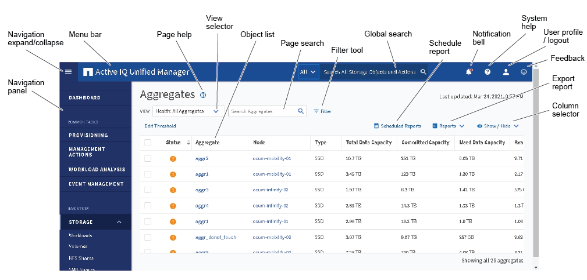
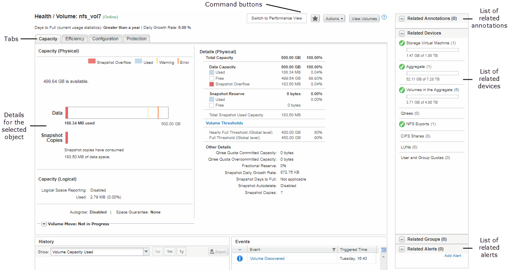

= Typische Fensterlayouts
:allow-uri-read: 
:icons: font
:imagesdir: ../media/

[role="lead"]
Wenn Sie die typischen Fensterlayouts verstehen, können Sie Active IQ Unified Manager effektiv navigieren und verwenden.  Die meisten Unified Manager-Fenster ähneln einem von zwei allgemeinen Layouts: Objektliste oder Details.  Die empfohlene Anzeigeeinstellung beträgt mindestens 1280 x 1024 Pixel.

Nicht jedes Fenster enthält jedes Element der folgenden Diagramme.

== Layout des Objektlistenfensters

== Layout des Fensters „Objektdetails“

